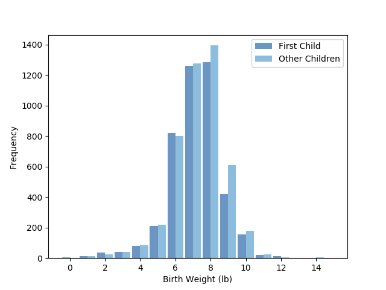

[Think Stats Chapter 2 Exercise 4](http://greenteapress.com/thinkstats2/html/thinkstats2003.html#toc24) (Cohen's d)

Code in a Jupyter Notebook may be found at .
```python
# package imports
import thinkstats2
import thinkplot
import nsfg
import math

# read in data
preg = nsfg.ReadFemPreg()
first = preg[preg.birthord ==1]
other = preg[preg.birthord != 1]

# create histogram. numbers are rounded to the nearest whole
fh = thinkstats2.Hist(first['totalwgt_lb'].apply(lambda x: round(x,0)), label='First Child')
oh = thinkstats2.Hist(first['totalwgt_lb'].apply(lambda x: round(x,0)), label='Other Children')

wd = 0.45
thinkplot.PrePlot(2)
thinkplot.Hist(fh, align='right', width = wd)
thinkplot.Hist(oh, align='left', width = wd)
thinkplot.Show(xlabel='Birth Weight (lb)', ylabel='Frequency')


# calculate Cohen's D
fm = first.totalwgt_lb.mean()
om = other.totalwgt_lb.mean()
wgtco = thinkstats2.CohenEffectSize(first.totalwgt_lb, other.totalwgt_lb)
lgtco = thinkstats2.CohenEffectSize(first.prglngth, other.prglngth)
effectmag = math.fabs(wgtco / lgtco)

print('First Child Mean Weight (lb): ', fm)
print('Other Children Mean Weight (lb): ', om)
print('Cohen Effect Size: ', wgtco)
print('The effect size on weight is %.3f times that of on pregnancy length.' % effectmag)

```
The mean weight of firstborn babies was found to be 7.201 lb.
The mean weight of non-firstborn babies was found to be 7.326 lb.

The calculated Cohen Effect Size had a magnituted of 0.089.
Compared to the effect size of first vs non-first born children, this effect size is 0.081 times that of the effect on pregnancy lengths.



