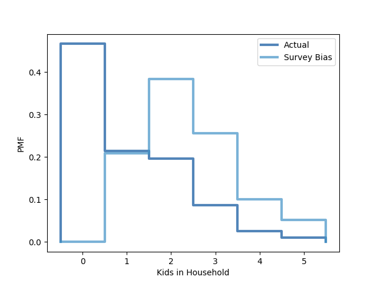

[Think Stats Chapter 3 Exercise 1](http://greenteapress.com/thinkstats2/html/thinkstats2004.html#toc31) (actual vs. biased)

Code in a Jupyter Notebook may be found at [`../ThinkStats2/code/dsp-questions.ipynb`](../ThinkStats2/code/dsp-questions.ipynb).

```python
# import data and generate pmf
from probability import BiasPmf
import thinkstats2
import thinkplot
import nsfg

resp = nsfg.ReadFemResp()

actual = thinkstats2.Pmf(resp['numkdhh'], 'Actual')
survey = BiasPmf(actual, 'Survey Bias')

# plot pmf
thinkplot.PrePlot(2)
thinkplot.Pmfs([actual, survey])
thinkplot.Show(xlabel='Kids in Household', ylabel='PMF')
```


The biased PMF accurately represents what the outcome of a survey on household children may look like.

```python
sum = 0
for k, v in actual.Items():
    sum += k * v
    i += 1

print("The average number of children in a household is: ", sum)

sum = 0
for k, v in survey.Items():
    sum += k * v
    i += 1
print("The average number of children in a household as taken from a survey would be: ", sum)
```
