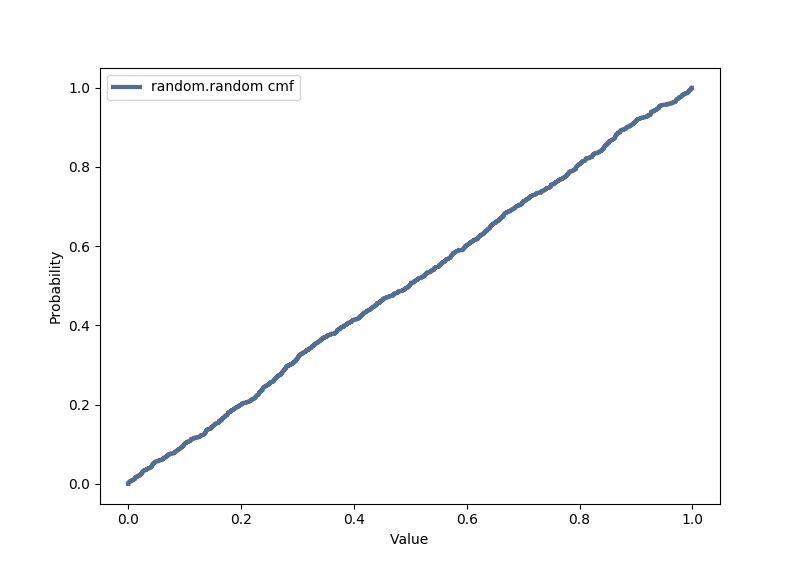

[Think Stats Chapter 4 Exercise 2](http://greenteapress.com/thinkstats2/html/thinkstats2005.html#toc41) (a random distribution)

Code in a Jupyter Notebook may be found at [`../ThinkStats2/code/dsp-questions.ipynb`](../ThinkStats2/code/dsp-questions.ipynb).

```python
import thinkstats2
import thinkplot
import random

rand = []

for i in range(1000):
    rand.append(random.random())
    
rp = thinkstats2.Pmf(rand, label='random.random pmf')
rc = thinkstats2.Cdf(rand, label='random.random cdf')

thinkplot.Pmf(rp)
thinkplot.Show(xlabel='Value', ylabel='Probability')
```



The PMF shows that all values in the range of random.random() have approximately equal chance of being selected. The CDF shows that the cumulative probability linearly increases down the range. Both these graphs indicate that the random.random() function is working as intended.
